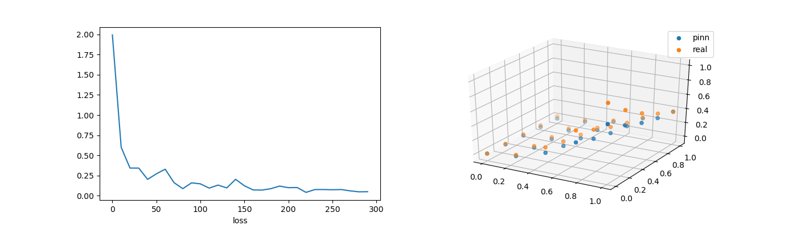
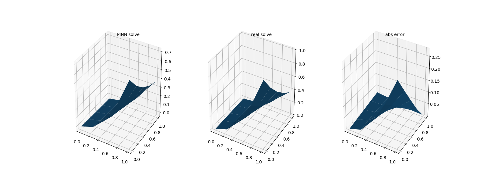

# pinn
pinn for test

    Experiment environment:
    python: 3.8
    torch: 1.12.1
    torchvision: 0.13.1
    numpy: 1.23.5
    pandas: 2.0.1
    matplotlib: 3.5.1
    sklearn: 1.2.2

# param
    h = 10 # gird size
    N_i = 10 # inner point
    N_b = 5 # bounding point
    N_data = 10 # data point

# result

